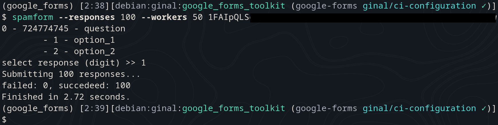

# Google forms
This is a Python library that provides convenient and efficient interaction with Google Forms. It offers functionalities to retrieve all the questions from a Google Form and submit responses programmatically. With this package, You can seamlessly integrate Google Forms into Your applications and automate form submission processes.

For now only these types of questions are supported:
- multiple choice question
- text answer questions
    - short answer question
    - paragraph question
- dropdown question
- checkboxes question
- dropdown question
- linear scale question
- grid question

## Instalation:
```console
$ git clone https://github.com/piotr-ginal/google-forms.git
$ cd google-forms
$ python -m pip install -e .
```

## Spammers
scripts that will automatically send responses to a given form
### threaded_spammer_1.py
tool that enables users to send multiple responses to any Google Form with ease. This script prompts the user to provide answers for each question interactively, making it highly flexible for various data submission scenarios. It can also generate pseudo-random responses for every supported question type - `--random` option must be used.

#### Usage:
```console
$ python threaded_spammer_1.py [--random]
```
1. You will be asked for the ID of your form. Provide the ID when prompted.
2. When not using `--random`: Answer each question on the form when prompted.
3. At the end, specify the number of replies you want to send (e.g., 500).

Example:

Result of running the script:


Please note that the threaded_spammer_1.py script currently supports the following types of questions:
- text answer questions (short answer question and paragraph question)
- dropdown question
- multiple choice question
- checkboxes question

If your form contains an unsupported question the script will stop. Please remember that if the forms creator disabled multiple answers per user the script wont work.
